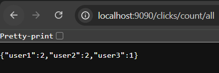

# 🖱️ Application Click Counter

Cette application illustre un pipeline complet avec Kafka Streams pour le suivi en temps réel d’événements de clics utilisateurs.

## 🏗️ Architecture

- Une application Spring Boot expose une interface simple avec un bouton : chaque clic génère un événement `click` avec un `userId` aléatoire, envoyé au topic Kafka `clicks`.
- Un **processeur Kafka Streams** regroupe les clics par utilisateur et les compte en direct.
- Les résultats sont publiés dans le topic `click-counts`.
- Un **service REST** consomme ces résultats et expose des endpoints :
  - `/clicks/count/all`: récupère le nombre total de clics par utilisateur.
  - `/clicks/count/{userId}`: récupère le nombre de clics pour un utilisateur donné.

## ▶️ Exécution

Assurez-vous que Kafka est lancé (`docker-compose up`) , puis :

```bash
cd click-counter-app
mvn spring-boot:run
```

## 📊 Exemple de sortie

```
User: user1 -> Clicks: 3
User: user2 -> Clicks: 5
```

## 🖼️ Démonstration


 - Interface HTML permettant de générer des clics (aléatoires par utilisateur).


- Consommateur Kafka affichant les événements bruts du topic clicks.


- Consommateur Kafka affichant les comptages agrégés par utilisateur (click-counts).


- Exemple de requête API REST pour un utilisateur donné (/clicks/count/{userId}).


- Exemple de requête API REST listant tous les utilisateurs (/clicks/count/all).




