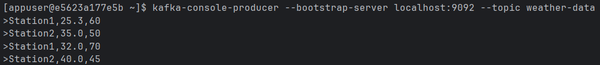
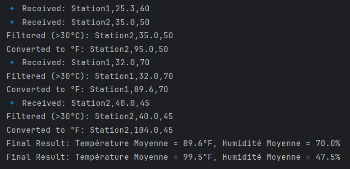

# 🌦️ Application Weather Stream

Un projet basé sur Kafka Streams qui traite des flux simulés de données météorologiques.

## ⚙️ Fonctionnalités
- Consommation de métriques météo (température, humidité, etc.) depuis un topic Kafka.
- Application de transformations de flux :
  - Filtrage (ex. exclure températures > 30°C), 
  - Conversions (Celsius → Fahrenheit), 
  - Agrégations (moyenne température / humidité par station).
- Publication des résultats transformés vers un nouveau topic Kafka.

## ▶️ Lancement

Démarrer Kafka :
```bash
docker-compose up -d
```

Puis exécuter l’application :

```bash
cd weatherStreamApp
mvn spring-boot:run
```

## 📌 Remarques

Le topic `weather-data` doit être créé et alimenté avec des événements météo au format JSON.

## 📷 Captures

- Exemple de producteur Kafka envoyant des données météo brutes vers le topic weather-data :

``` 
StationName,Temperature(°C),Humidity(%).
```


- Journal temps réel de l’application Kafka Streams appliquant filtres et calculs :




- Consommation du topic station-averages, affichant les moyennes calculées par station :


